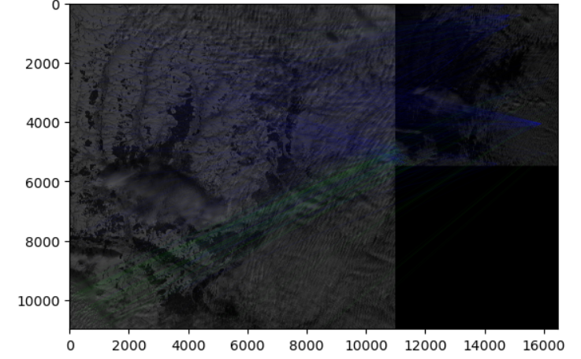

## How Setup and Execution code

1. **Clone the repository**:
    ```sh
    git clone https://github.com/Andrii-Bezkrovnyi/data_science_test.git
    ```
2. **Create a virtual environment**:
    ```sh
    python -m venv venv
    venv\Scripts\activate (on Windows) 
    source venv/bin/activate  (on Linux)
    ```

3. **Install the required packages**:
    ```sh
    pip install -r requirements.txt
    ```

4. **Download dataset via command**:
    ```sh
    kaggle datasets download isaienkov/deforestation-in-ukraine
    ```

5. **Unzip the dataset via Dataset_download.ipynb by Anaconda Navigator**

6. **Prepare dataset via running data_preparation.ipynb**

7. **Train the model via running train_model.py in the console**:
    ```sh
    python train_model.py
    ```
8. **Run the model via Demo.ipynb by Anaconda Navigator**

## Example of model result
